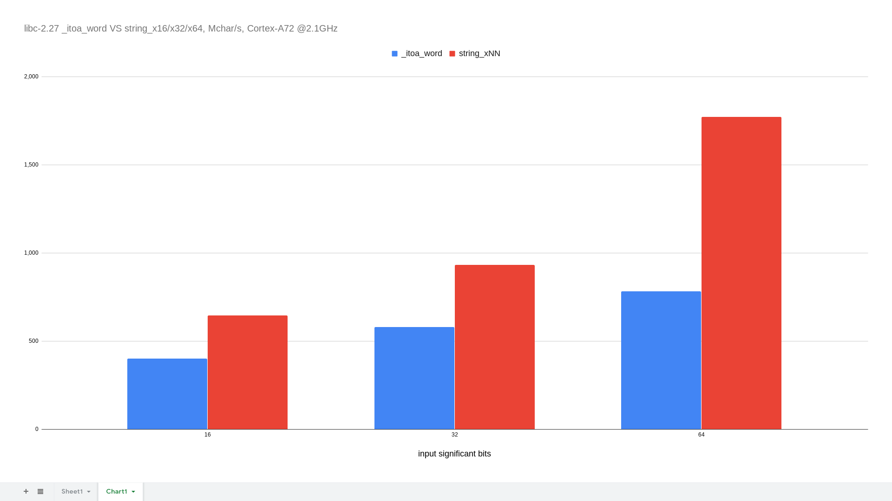

# hello-gcclessness
What do you do when you're on vacation and you're left without a compiler?

Fall back to `as` and `ld`, of course.

# building
The build script works on native aarch64 as well as on a specific arm64-deb-packages-over-armhf-userspace setup.

	$ ./build.sh # for string_xNN  
	$ ./build.sh --defsym test_itoa=1 # for libc _itoa_word

# benchmarking
All data in L1 caches, optimal alignment:

| uarch/function                         | total time for 2^28 funcalls | Mfuncall/s | Mchar/s | clk/char |
| -------------------------------------- | ---------------------------- | ---------- | ------- | -------- |
| **string_x16** : 16-bit hex to string  |                              |            |         |          |
| Cortex-A72 @2.1GHz                     | 0m1.662s                     |  162       |  646    |  3.25    |
| Cortex-A72 @2.0GHz                     | 0m1.746s                     |  154       |  615    |  3.25    |
| Cortex-A53 @1.5GHz                     | 0m3.582s                     |   75       |  300    |  5.00    |
| **string_x32** : 32-bit hex to string  |                              |            |         |          |
| Cortex-A72 @2.1GHz                     | 0m2.301s                     |  117       |  933    |  2.25    |
| Cortex-A72 @2.0GHz                     | 0m2.414s                     |  111       |  890    |  2.25    |
| Cortex-A53 @1.5GHz                     | 0m3.590s                     |   75       |  598    |  2.51    |
| **string_x64** : 64-bit hex to string  |                              |            |         |          |
| Cortex-A72 @2.1GHz                     | 0m2.462s                     |  109       | 1745    |  1.20    |
| Cortex-A72 @2.0GHz                     | 0m2.585s                     |  104       | 1661    |  1.20    |
| Cortex-A72 @1.8GHz                     | 0m2.875s                     |   93       | 1494    |  1.20    |
| Cortex-A73 @1.8GHz                     | 0m1.794s                     |  150       | 2394    |  0.75    |
| Cortex-A53 @1.5GHz                     | 0m4.300s                     |   62       |  999    |  1.50    |
| **string_x64_1** : alt scheduling      |                              |            |         |          |
| Cortex-A72 @2.1GHz                     | 0m2.422s                     |  111       | 1773    |  1.18    |
| Cortex-A72 @2.0GHz                     | 0m2.552s                     |  105       | 1683    |  1.19    |
| Cortex-A73 @1.8GHz                     | 0m1.793s                     |  150       | 2395    |  0.75    |
| Cortex-A53 @1.7GHz                     | 0m3.637s                     |   74       | 1181    |  1.44    |
| Cortex-A53 @1.5GHz                     | 0m4.116s                     |   65       | 1043    |  1.44    |

In comparison, libc-2.27 **\_itoa_word** [^1] performance:

| uarch/function                         | total time for 2^28 funcalls | Mfuncall/s | Mchar/s | clk/char |
| -------------------------------------- | ---------------------------- | ---------- | ------- | -------- |
| **\_itoa_word** : 16-bit hex to string |                              |            |         |          |
| Cortex-A72 @2.1GHz                     | 0m2.685s                     |  100       |  400    |  5.25    |
| **\_itoa_word** : 32-bit hex to string |                              |            |         |          |
| Cortex-A72 @2.1GHz                     | 0m3.705s                     |   72       |  580    |  3.62    |
| **\_itoa_word** : 64-bit hex to string |                              |            |         |          |
| Cortex-A72 @2.1GHz                     | 0m5.490s                     |   49       |  782    |  2.68    |

[^1]: libc inner implementation of **itoa**, sans stack guards and fail checks. Uses LUTs and supports upper- and lower-case translations.

